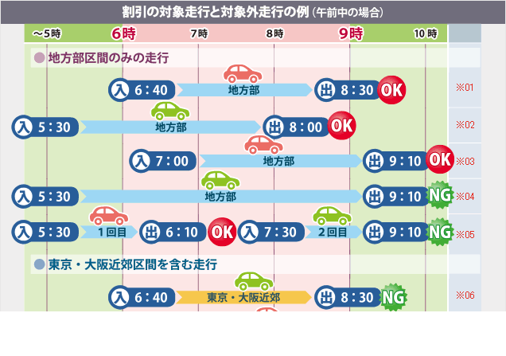
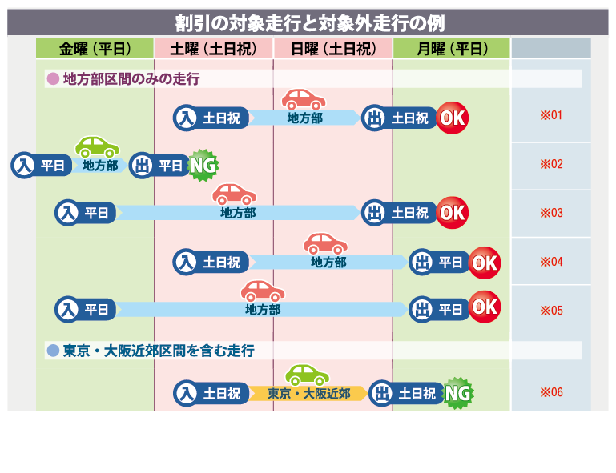
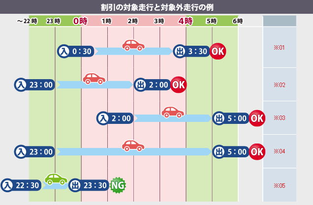

# KATA01 - Discount Logic of Electronic Toll Collection System

高速道路のETC割引の計算ロジックを実装します。
- 走行記録は、24時間を超えないものとします。

# 業務ルール
割引には以下の3種類があります。

- 平日朝夕割引
- 休日割引
- 深夜割引

それぞれの割引を適用できる条件と、割引率は以下のとおりです。  
複数の割引が適用できる場合、 **最も割引率が高い割引が1つだけ** 適用されます。

---

## 平日朝夕割引

### 割引対象車種
- すべての車種

### 割引対象エリア
- 地方部

### 割引対象日時
平日かつ、朝「6:00〜9:00」、あるいは夕「17:00〜20:00」に、 **入口または出口料金所を通過**する


### 割引率
当月の高速道路利用回数によって変動します。

- 0〜4回: 0%
- 5回〜9回: 30%
- 10回以上: 50%

---

## 休日割引

### 割引対象車種
- 普通車
- 軽自動車等
- 二輪車

### 割引対象エリア
- 地方部

### 割引対象日時
土曜・日曜・祝日を **一部でも含む** 走行


### 割引率
- 30%

---

## 深夜割引

### 割引対象車種
- すべての車種

### 割引対象エリア
- すべて

### 割引対象日時
0~4時を **一部でも含む** 走行



### 割引率
- 30%

# 問題

上記の業務ルールに従って、割引率を計算する `DiscountCalculator` を、
 **割引のパターンが増えたとしても理解しやすく、メンテナンスが楽なように** 実装してください。

classやtrait、objectなどを新しく作ったり、既存のmodelにメソッドを新しく追加してOKです。

```scala
class DiscountCalculator {
    def calc(drive: HighwayDrive): DiscountPercentage = ???
}
```

## 既存のコードについて

- DiscountCalculator: これを実装する

### model パッケージ
- Driver: ドライバー。「今月に何回高速道路を利用したか」の情報を持っている
- HighwayDrive: 1ドライバーの、1回の高速道路の走行記録
- VehicleFamily: 車種
- AreaType: 高速道路のエリア
- DiscountPercentage: 割引率のパーセンテージ

### util パッケージ
- HolidayUtils: 休日の判定用。 `isHoliday(d: LocalDate): Boolean` と `printHolidays(): Unit` がpublic。

